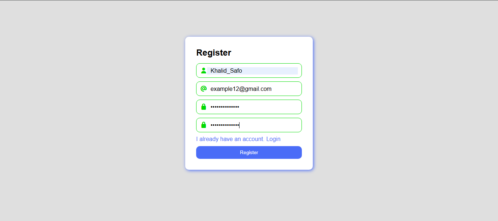
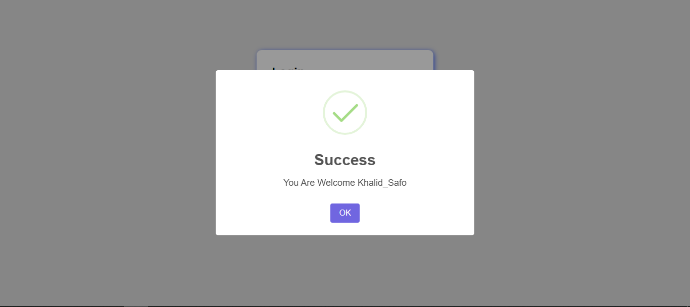
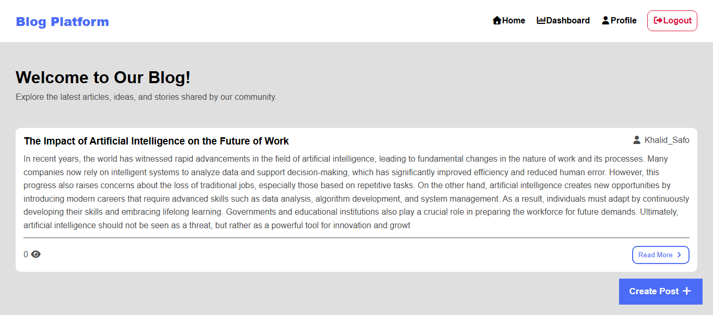
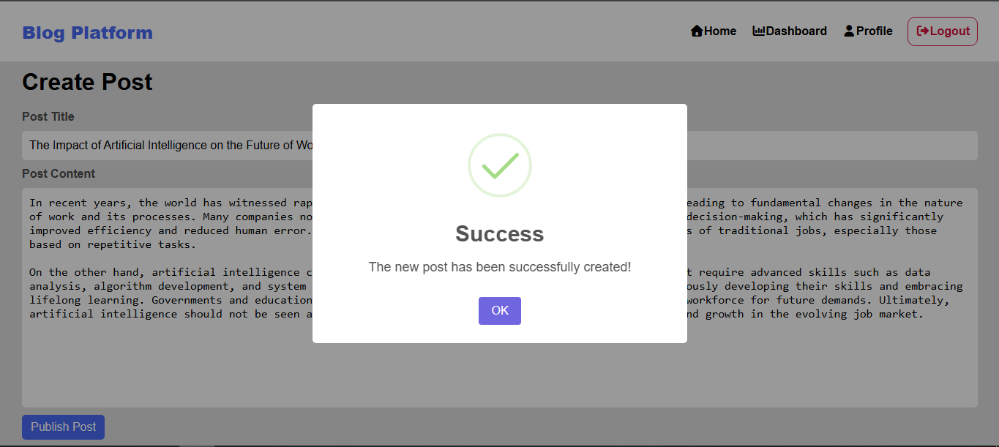
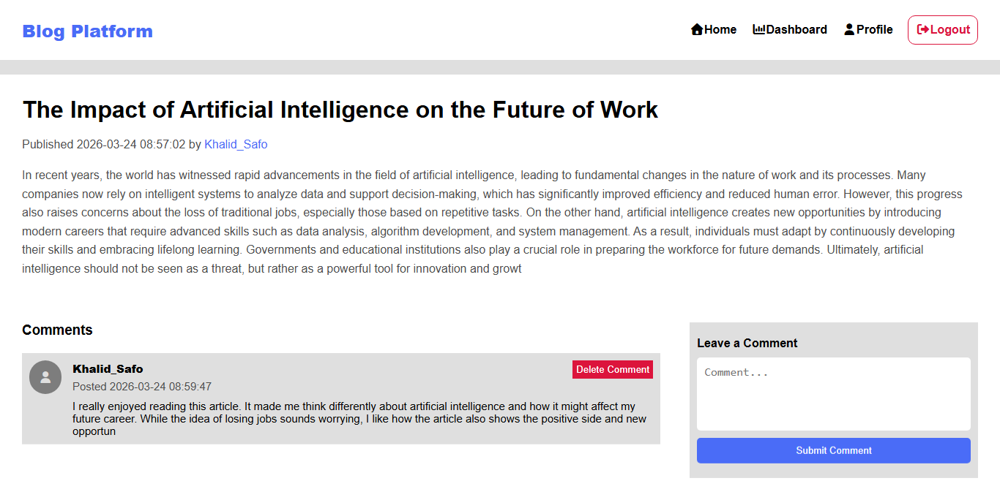
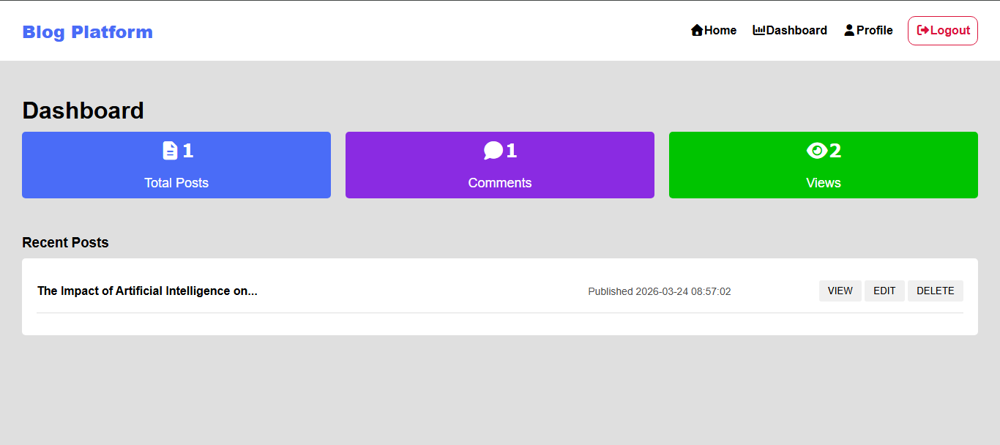
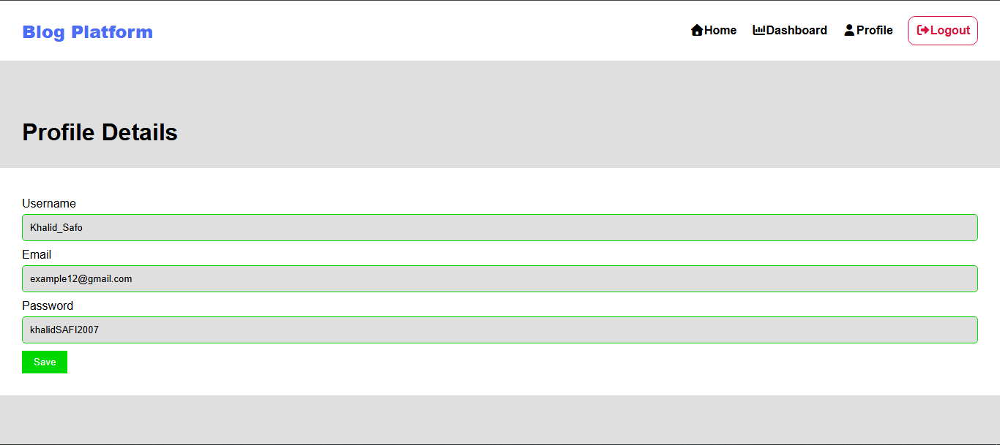

# Blog Platform

<!-- Add your first image here -->

## Project Description
**Blog Platform** is a professional blogging platform developed using **PHP** that allows content management, creating posts, comments, and managing users securely and efficiently. Users can read articles and interact with them, while the backend API is secured using **JWT Authentication**.

The project is designed to be **flexible and scalable**, making it easy to add new features such as categories, likes, or notifications.

## Skills & Technologies Used
- **PHP** – Core programming language.
- **RESTful API** – For structured data access and operations.
- **JWT Authentication** – Secures API access for users.
- **MySQL / SQL Database** – Structured data storage.
- **JavaScript & CSS** – For interactivity and improved UI.
- **MVC-like Structure** – Clean, maintainable code organization.

## Key Features
- User management and authentication.
- Add, edit, and delete posts.
- Comment system for posts.
- Post view counter.
- Secure API with JWT.
- Clean and extensible project structure.

## How to Run
1. Clone the repository:

git clone https://github.com/Khalid-Safi207/blog-platform.git⁠

2. Create a new database and import `database.sql` if provided.
3. Update database connection settings in `config/database.php`.
4. Run your local server (e.g., XAMPP, Laragon).
5. Open in browser:

http://localhost/blog-platform/public

## Contribution
Feel free to contribute by creating a new branch, testing your changes, and submitting a pull request.

## License
Open-source project – free to use and modify.
